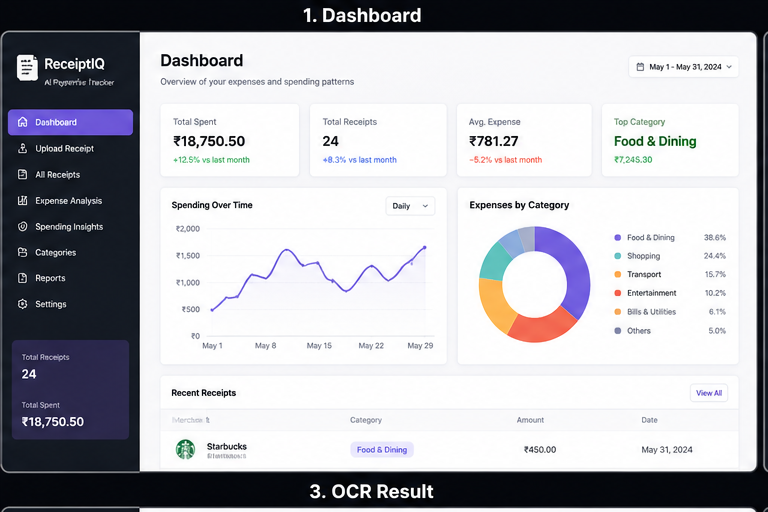
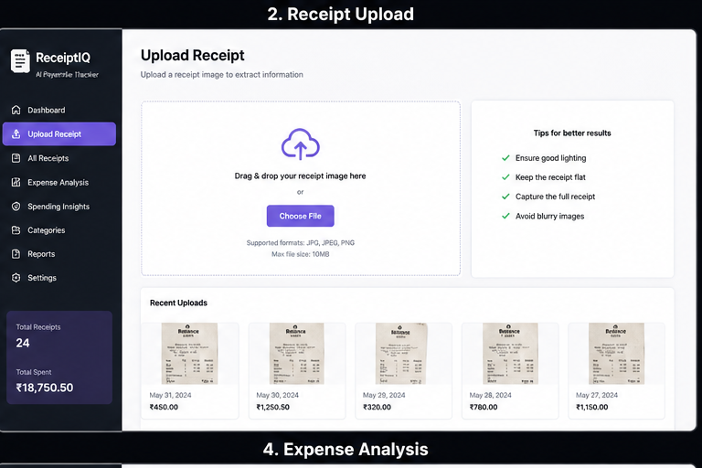
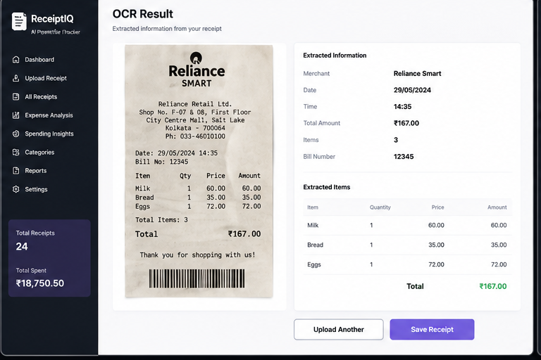
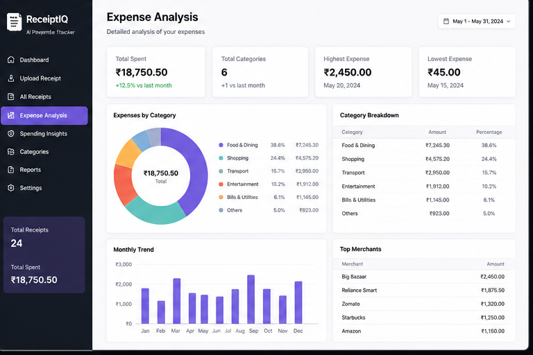

## System Architecture

```text
                Receipt Image
                       │
                       ▼
                   EasyOCR
                       │
                       ▼
               Entity Extraction
                       │
                       ▼
              Transaction Database
                       │
       ┌───────────────┼───────────────┐
       ▼               ▼               ▼

 Expense         Forecasting      Anomaly
Classifier         Model         Detection
       │               │               │
       └───────┬───────┴───────┬───────┘
               ▼
      Recommendation Engine
               │
               ▼
        Financial Insights
```

---

## Data Processing Pipeline

```text
Receipt Image
    ↓
EasyOCR
    ↓
Text Cleanup
    ↓
Entity Extraction
    ↓
JSON Output
```

Example Output:

```json
{
  "merchant": "ICHIBAN SUSHI",
  "amount": 223000,
  "date": "Aug 19, 2024",
  "items": 6,
  "category": "Food"
}
```

---

## Machine Learning Models

### Expense Classification

* Logistic Regression
* Random Forest
* XGBoost

### Forecasting

* Time Series Spending Forecast Model

### Anomaly Detection

* Transaction Outlier Detection

### Recommendation Engine

* Rule-Based Financial Advisor
* Expense Optimization Suggestions

---

## Features

✅ Receipt OCR using EasyOCR

✅ Merchant Extraction

✅ Amount Extraction

✅ Date Extraction

✅ Item Count Detection

✅ Expense Classification

✅ Spending Forecasting

✅ Anomaly Detection

✅ Financial Recommendation Engine

✅ Interactive Streamlit Dashboard

✅ Real-Time Receipt Analytics

---

## Screenshots

### Dashboard



### Receipt Upload



### OCR Result



### Expense Analysis



---

## Tech Stack

**Frontend**

* Streamlit
* Plotly

**Backend**

* Python

**Machine Learning**

* Scikit-Learn
* XGBoost

**Data Processing**

* Pandas
* NumPy

**OCR & NLP**

* EasyOCR
* Regex Based Entity Extraction

---

## Project Author

**Muntazir Alam**

B.Tech CSE | AI & Data Science Enthusiast

GitHub: https://github.com/Muntaziralam143

```
```
